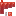

# Mold
 

## Description:
The Mold block is a type of fungus that can grow on Nether Mycelium. It survives as long as it remains in contact with the mycelium or has another solid block above it. This allows the Mold to thrive in a variety of environments within The Nether, and can be used by players to cultivate its growth.

Drops itself when broken.
