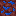

# Nether cactus
 

## Description:
The Nether Cactus is a plant-like block that can grow on gravel surfaces. It grows by spreading upwards, replacing other blocks of the same type with itself, and has a chance to spread downwards if it's not covered by another Nether Cactus or an air block. If a Nether Cactus is destroyed, it will replace the space above it with a new block in its place.

Drops itself when broken.
