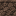

# Soul sandstone
 

## Description:
Soul Sandstone is a type of nether terrain that interacts with stone-related behaviors in Minecraft. It can have different states depending on the surrounding blocks and environment, which affects how it behaves. This block has some unique properties when placed next to other blocks or in certain situations, making it distinct from regular stone or sandstone.

Drops itself when broken.
