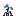

# Stalagnate seed
 

## Description:
The Stalagnate seed is a feature sapling that can grow into a stalactite or stalagmite structure when planted in the overworld. It grows downward by default, but can also grow upward if placed on top of another block. The Stalagnate seed has a high chance to survive when spawned naturally in Nether biome and requires minimal upkeep once grown.

Drops itself when broken.

## Found in:
### Blocks Loot Tables:
 - Stalagnate seed
 - Stalagnate trunk
