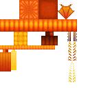

# Hydrogen jellyfish
 

## Description:
The Hydrogen Jellyfish is an aquatic mob that spawns in calm ocean waters at night. It can move freely underwater, occasionally rising to the surface to breathe and emit a sound effect. The jellyfish does not interact with players or other mobs, but its presence can affect the surrounding environment.
