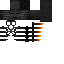

# Naga
 

## Description:
The Naga is a hostile mob that inhabits the Nether. It has a unique attack pattern where it shoots projectiles at players and other mobs within a certain range, and can occasionally become aggressive towards nearby entities. Nagas have a moderate spawn rate in the Nether, often spawning in areas with relatively low mob density.

## Drops
 - 0 - 1 Coal
 - 0 - 2 Bone
 - 1 Wither skeleton skull
