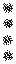

# Naga projectile
 

## Description:
The Naga Projectile is an entity that can be spawned by Entity Nagas to attack targets. When spawned, it will fly towards the target entity, potentially causing damage or other effects upon collision. If it fails to hit its intended target or runs out of life time, it will explode into smaller projectiles that also attempt to harm entities in their vicinity.

## Drops
 - 0 - 1 Coal
 - 0 - 2 Bone
 - 1 Wither skeleton skull
